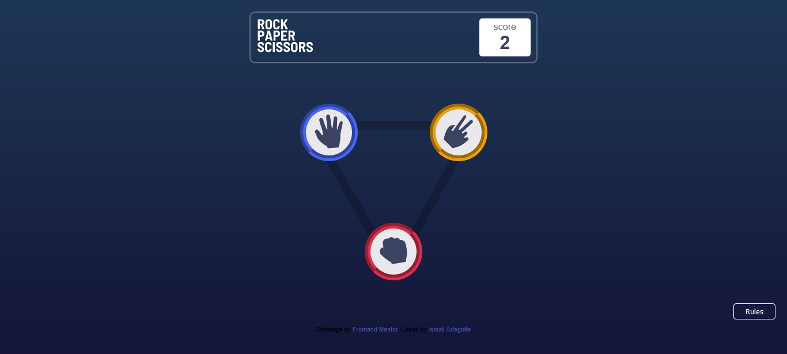

# Frontend Mentor - Rock, Paper, Scissors solution

This is a solution to the [Rock, Paper, Scissors challenge on Frontend Mentor](https://www.frontendmentor.io/challenges/rock-paper-scissors-game-pTgwgvgH). Frontend Mentor challenges help you improve your coding skills by building realistic projects. 

## Table of contents

- [Overview](#overview)
  - [The challenge](#the-challenge)
  - [Screenshot](#screenshot)
  - [Links](#links)
- [My process](#my-process)
  - [Built with](#built-with)
- [Author](#author)

## Overview

### The challenge

Users should be able to:

- View the optimal layout for the game depending on their device's screen size
- Play Rock, Paper, Scissors against the computer

### Screenshot

### Links

- [View solution here](https://github.com/Ismat27/rock-paper-scisssors)
- [View site here](https://smartdev-rockpaperscissors.netlify.app/)

## My process

### Built with

- Semantic HTML5 markup
- CSS
- Flexbox
- JavaScript
- Mobile-first workflow

## Author

- Website - [Ismail Adegbite](https://github.com/ismat27)
- Frontend Mentor - [@ismat27](https://www.frontendmentor.io/profile/ismat27)
- Twitter - [@@adegbite_ismail](https://www.twitter.com/@adegbite_ismail)

